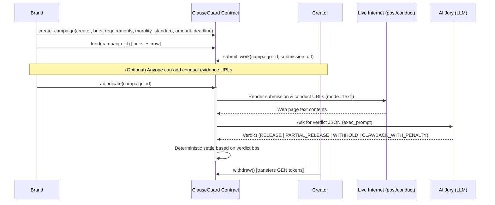

# ClauseGuard

**ClauseGuard** is a self-executing sponsorship and endorsement protocol for the creator economy built on GenLayer. It allows brands to lock native GEN tokens in escrow, which are automatically settled by an on-chain AI jury checking real-world proof of work and brand safety guidelines from the live web.

---

## Architecture Overview



---

## Repository Structure

*   `contracts/clauseguard.py`: Main Intelligent Contract.
*   `contracts/storage_test.py`: Sanity checking contract.
*   `prompts/jury_prompt.md`: AI jury brand safety rubric.
*   `tests/test_clauseguard.py`: Direct mode unit tests mocking LLM/Web rendering.
*   `docs/DEPLOY_STUDIO.md`: Deployment instructions for GenLayer Studio.
*   `scripts/deploy_notes.md`: Development tracking notes.

---

## Getting Started

### Prerequisites

*   Python 3.12+
*   Node.js 18+
*   GenLayer Studio or Simulator

### Installing Dependencies

Install python testing dependencies:
```bash
pip install genlayer-test pytest
```

---

## Testing

Run tests locally in Direct Mode (in-memory):
```bash
gltest tests/ -v
```

---

## Deployment to GenLayer Studio

For step-by-step instructions on deploying the sanity contract first, resetting storage, and deploying the main contract, see [docs/DEPLOY_STUDIO.md](docs/DEPLOY_STUDIO.md).
